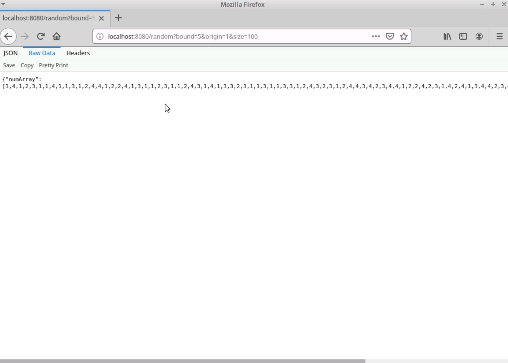
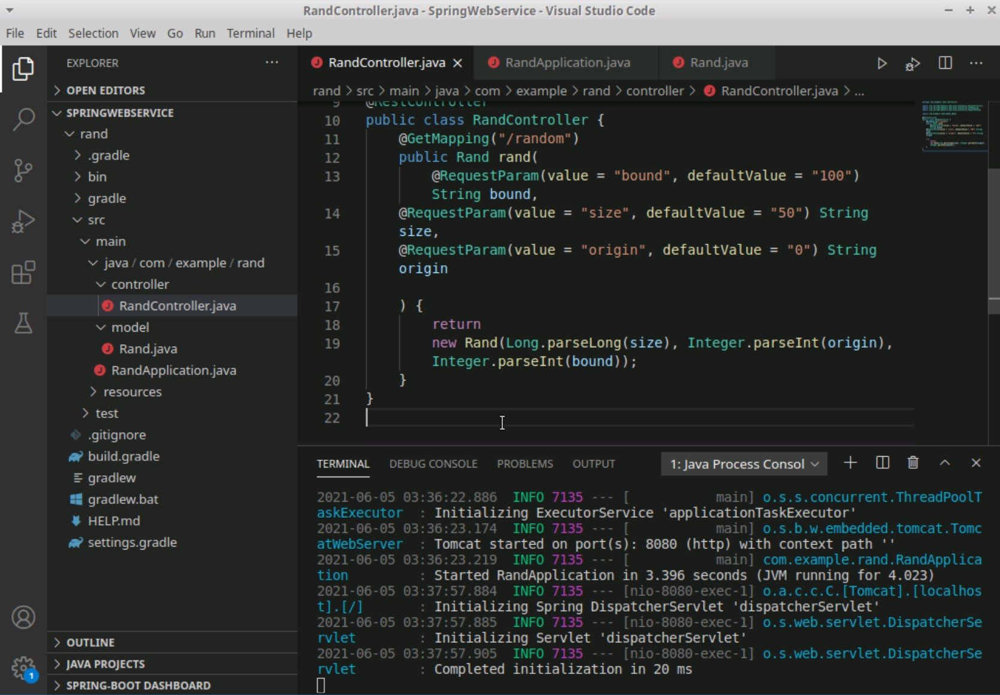
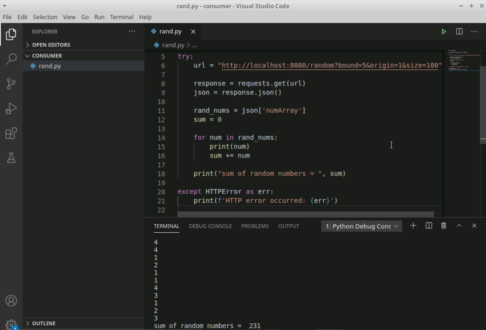

# 🎲 Spring Boot Random Numbers Service

A RESTful web service built with Spring Boot that generates customizable random number sequences. Includes a Python client demonstrating cross-language service consumption.



## 🚀 Features

- RESTful API for random number generation
- Configurable parameters (size, range, origin)
- Built with Spring Boot and Gradle
- Python client implementation
- Automatic JSON response formatting

## 🛠️ Technical Stack

- **Backend**: Java 11, Spring Boot 2.x
- **Build System**: Gradle
- **API Testing**: Python requests library
- **Server**: Embedded Tomcat
- **IDE**: VS Code with Spring Boot extensions

## 🏗️ Architecture

### Core Components

1. **Model (`Rand.java`)**
```java
public class Rand {
    private int[] numArray;
    
    public Rand(long size, int origin, int bound) {
        Random random = new Random();
        size = size < 1001 ? size : 1000;
        numArray = random.ints(size, origin, bound).toArray();
    }
}
```

2. **Controller**
- Handles HTTP GET requests
- Parameter validation
- Response formatting

3. **Python Client**
- Service consumption example
- Error handling
- Response processing

## 📝 API Reference

### Get Random Numbers
```http
GET /random?bound={bound}&origin={origin}&size={size}
```

| Parameter | Type | Description |
| :--- | :--- | :--- |
| `bound` | `int` | Upper bound (exclusive) |
| `origin` | `int` | Lower bound (inclusive) |
| `size` | `int` | Number of random values |

#### Response Example
```json
{
    "numArray": [3, 1, 4, 1, 5]
}
```

## 🚦 Getting Started

### Prerequisites
- Java 11+
- Python 3.x (for client)
- Gradle

### Server Setup
1. Clone repository:
```bash
git clone https://github.com/yourusername/random-numbers-service.git
cd random-numbers-service
```

2. Build project:
```bash
cd SpringWebService/rand
./gradlew build
```

3. Run server:
```bash
./gradlew bootRun
```

### Client Usage
1. Install Python requirements:
```bash
pip install requests
```

2. Run client:
```bash
cd consumer
python rand.py
```

## 🗂️ Project Structure
```
.
├── SpringWebService/        # Java Spring Boot service
│   └── rand/
│       ├── src/
│       │   ├── main/
│       │   │   ├── java/
│       │   │   └── resources/
│       │   └── test/
│       └── build.gradle
├── consumer/                # Python client
│   └── rand.py
└── demo/                    # Screenshots
```

## 🧪 Testing

Run Spring Boot tests:
```bash
./gradlew test
```

Test Python client:
```bash
python -m pytest consumer/test_rand.py
```

## 📸 Screenshots

<table>
  <tr>
    <td></td>
    <td></td>
  </tr>
</table>

## 🤝 Contributing

1. Fork repository
2. Create feature branch (`git checkout -b feature/AmazingFeature`)
3. Commit changes (`git commit -m 'Add AmazingFeature'`)
4. Push to branch (`git push origin feature/AmazingFeature`)
5. Open Pull Request

## 📄 License

Distributed under the MIT License. See `LICENSE` for more information.

## 🙏 Acknowledgments

- Spring Boot Documentation
- Python Requests Library
- RESTful API Best Practices
